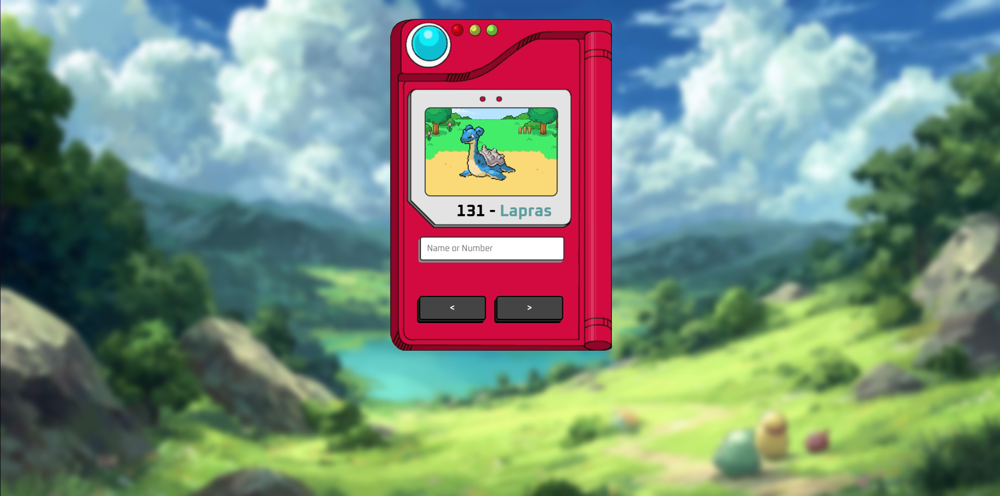

# Pokédex

> Gotta catch 'em all!

Projeto construído com o objetivo de praticar consumo de APIs e conceitos iniciais de JavaScript assíncrono.

## Objetivos
- Consumir dados da [PokéAPI](https://pokeapi.co)
- Trabalhar com `fetch`
- Entender `async/await`
- Manipular dados retornados em JSON
- Renderizar elementos dinamicamente no DOM

## Tecnologias utilizadas

- Git e Github
- HTML
- CSS
- JavaScript

## Conceitos praticados

- Requisições HTTP
- Programação assíncrona
- Manipulação de DOM
- Tratamento de erros
- Organização de funções
- Leitura e manipulação de JSON
